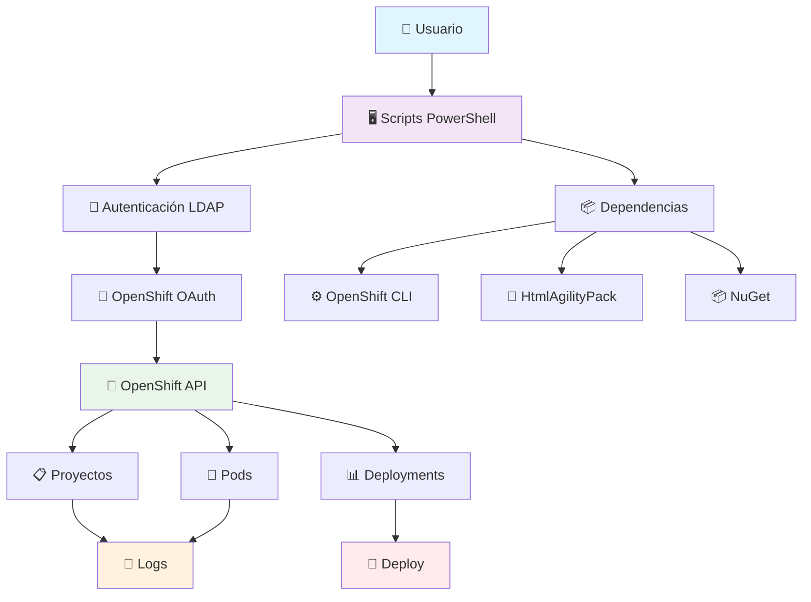
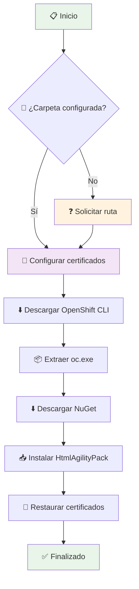
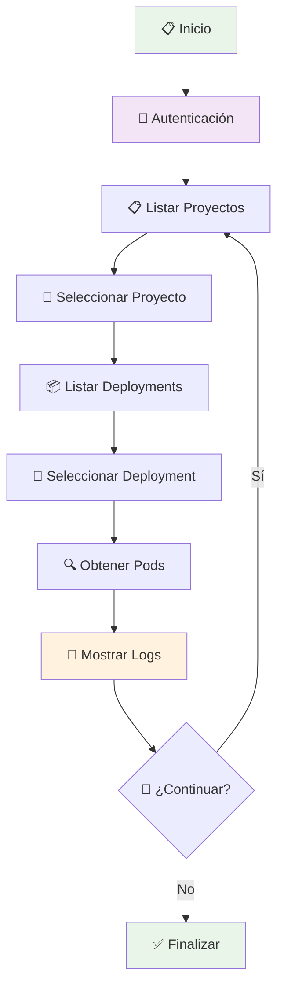
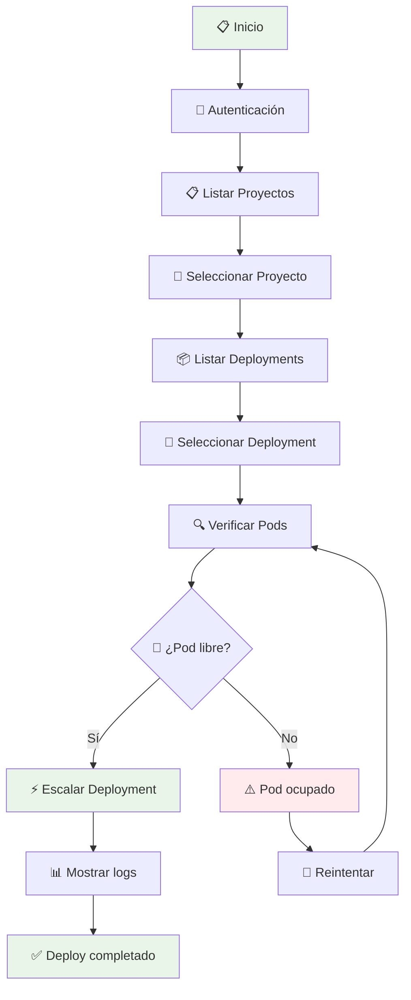
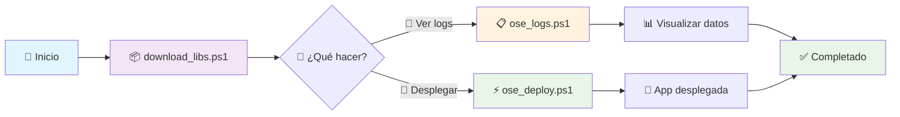

# 🔧 OpenShift Background Tasks

[](https://docs.microsoft.com/en-us/powershell/)
[](https://www.openshift.com/)
[](LICENSE)

Un conjunto de herramientas de PowerShell para automatizar tareas de background en OpenShift, incluyendo despliegue de aplicaciones, consulta de logs y gestión de contenedores.

## 📋 Tabla de Contenidos

- [Descripción](#-descripción)
- [Arquitectura](#-arquitectura)
- [Prerrequisitos](#-prerrequisitos)
- [Instalación](#-instalación)
- [Scripts Disponibles](#-scripts-disponibles)
  - [download_libs.ps1](#download_libsps1)
  - [ose_logs.ps1](#ose_logsps1)
  - [ose_deploy.ps1](#ose_deployps1)
- [Uso](#-uso)
- [Flujo de Trabajo](#-flujo-de-trabajo)
- [Accesos Directos](#-accesos-directos)
- [Solución de Problemas](#-solución-de-problemas)
- [Contribuir](#-contribuir)

## 🎯 Descripción

Este proyecto proporciona un conjunto de scripts de PowerShell que facilitan la interacción con OpenShift para:

- 📦 **Descargar e instalar** dependencias necesarias (OpenShift CLI, librerías)
- 📋 **Consultar logs** de aplicaciones desplegadas en tiempo real
- 🚀 **Desplegar aplicaciones** y gestionar su escalabilidad
- 🔐 **Autenticación automática** con servidores OpenShift
- 🎛️ **Interfaz gráfica** para selección de proyectos y pods

## 🏗️ Arquitectura



## ✅ Prerrequisitos

- 🖥️ **Windows** con PowerShell 5.1 o superior
- 🌐 **Acceso a Internet** para descargas de dependencias
- 🔐 **Credenciales LDAP** válidas para OpenShift
- 📂 **Permisos de escritura** en el directorio de instalación

## 🚀 Instalación

### 1. Descarga y Extracción

```powershell
# Descomprimir el archivo ose_deploy_background.zip en tu directorio preferido
# Ejemplo: C:\Tools\ose_deploy_background\
```

### 2. Configuración de Variables de Entorno (Opcional)

```powershell
$env:OSE_DEPLOY_BACKGROUND_FOLDER = "C:\Tools\ose_deploy_background"
$env:OSE_DEPLOY_BACKGROUND_SCRAPPER_INSTALLED = "true"
```

### 3. Instalación de Dependencias

```powershell
# Ejecutar primero el script de descarga de librerías
.\download_libs.ps1 -oseRuntimeFolder "C:\Tools\ose_deploy_background"
```

## 📋 Scripts Disponibles

### `download_libs.ps1`

**🎯 Propósito**: Descarga e instala todas las dependencias necesarias.



**Funcionalidades**:
- ✅ Descarga automática del cliente OpenShift CLI
- ✅ Instalación de HtmlAgilityPack para parsing HTML
- ✅ Configuración temporal de certificados SSL
- ✅ Limpieza automática de archivos temporales

### `ose_logs.ps1`

**🎯 Propósito**: Consulta y visualiza logs de aplicaciones OpenShift.



**Parámetros**:
```powershell
.\ose_logs.ps1 -oseRuntimeFolder "C:\Tools" -user "usuario" -securePassword $securePass
```

### `ose_deploy.ps1`

**🎯 Propósito**: Despliega y escala aplicaciones en OpenShift.



**Parámetros**:
```powershell
.\ose_deploy.ps1 -oseRuntimeFolder "C:\Tools" -user "usuario" -securePassword $securePass
```

## 💻 Uso

### Ejemplo Básico

```powershell
# 1. Instalar dependencias
.\download_libs.ps1

# 2. Consultar logs
.\ose_logs.ps1 -user "mi_usuario"

# 3. Desplegar aplicación
.\ose_deploy.ps1 -user "mi_usuario"
```

### Uso Avanzado con Parámetros

```powershell
# Configurar contraseña segura
$securePassword = Read-Host -AsSecureString "Ingrese su contraseña"

# Ejecutar con parámetros completos
.\ose_logs.ps1 -oseRuntimeFolder "C:\Tools\ose" -user "mi_usuario" -securePassword $securePassword
```

## 🔄 Flujo de Trabajo



## 🔗 Accesos Directos

Crea accesos directos en Windows para ejecutar los scripts fácilmente:

### Para Logs
```powershell
# Destino del acceso directo:
C:\Windows\System32\WindowsPowerShell\v1.0\powershell.exe -ExecutionPolicy Bypass -File "RUTA_COMPLETA\ose_logs.ps1" -oseRuntimeFolder "RUTA_COMPLETA" -user "tu_usuario"
```

### Para Deploy
```powershell
# Destino del acceso directo:
C:\Windows\System32\WindowsPowerShell\v1.0\powershell.exe -ExecutionPolicy Bypass -File "RUTA_COMPLETA\ose_deploy.ps1" -oseRuntimeFolder "RUTA_COMPLETA" -user "tu_usuario"
```

## 🛠️ Solución de Problemas

### ❌ Error de Certificados SSL
```powershell
# Los scripts manejan automáticamente los certificados
# Si persiste el error, ejecutar como administrador
```

### ❌ Error de Autenticación
```powershell
# Verificar credenciales LDAP
# Comprobar conectividad con el servidor OAuth
```

### ❌ OpenShift CLI no encontrado
```powershell
# Ejecutar nuevamente download_libs.ps1
# Verificar la ruta oseRuntimeFolder
```

### 📊 Logs de Debug
Los scripts proporcionan información detallada durante la ejecución para facilitar el diagnóstico.

## 🤝 Contribuir

1. 🍴 Fork el proyecto
2. 🌿 Crea una rama para tu feature (`git checkout -b feature/nueva-funcionalidad`)
3. 💾 Commit tus cambios (`git commit -am 'Añadir nueva funcionalidad'`)
4. 📤 Push a la rama (`git push origin feature/nueva-funcionalidad`)
5. 🔄 Abre un Pull Request

## 📄 Licencia

Este proyecto está bajo la licencia MIT - ver el archivo [LICENSE](LICENSE) para más detalles.

---

**🔧 Desarrollado para automatizar y simplificar las operaciones de OpenShift** 🚀
